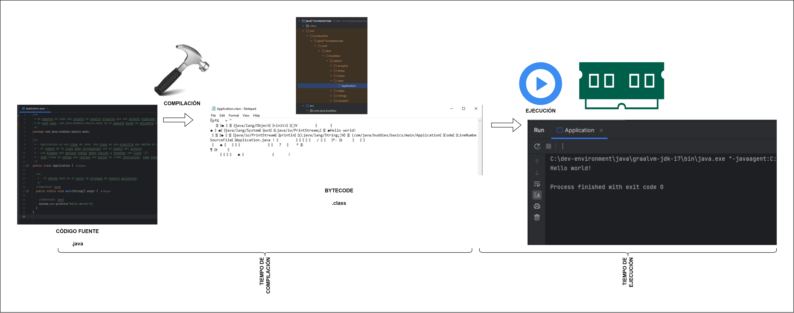

# INTRODUCCIÓN

[← Regresar a notas](../../README.md) <br>

---

> #### Computadora
> Dispositivo electrónico que procesa datos y ejecuta instrucciones a través de programas.

> #### Bit
> Es la unidad mínima de información en una computadora y se representa con un valor binario: `0` o `1`.

> #### Byte
> Es un conjunto de 8 bits. Los bytes se utilizan para almacenar caracteres, como letras o números, y otras formas de datos en una computadora.

> #### Lenguaje de programación
> Es un conjunto de reglas y símbolos que permite a los programadores escribir instrucciones que una computadora puede entender y ejecutar.

> #### Lenguaje de máquina
> Es el lenguaje más básico que entiende una computadora, compuesto exclusivamente de instrucciones en código binario (0s y 1s).

> #### Lenguaje de alto nivel
> Es un tipo de lenguaje de programación que se asemeja más al lenguaje humano y está diseñado para ser fácil de entender y usar por los programadores (`Java`, `Python`, `Go`, etc.).

> #### IDE (Entorno de Desarrollo Integrado)
> Es una aplicación que proporciona un conjunto de herramientas para escribir, probar y depurar código de manera eficiente, mejorando la productividad del programador.

> #### Código fuente
> Es el conjunto de instrucciones escritas en un lenguaje de programación.

> #### Compilación
> Es el proceso de traducción del código fuente escrito en un lenguaje de programación entendible por el humano a un lenguaje de bajo nivel que la computadora pueda entender y ejecutar.

> #### Tiempo de compilación (compile time)
> - Se refiere al periodo en el que el compilador convierte el código fuente en código de máquina o bytecode ejecutable.  
> - Durante este proceso, el compilador analiza la sintaxis del código, verifica su coherencia y genera el código ejecutable.  

> #### Tiempo de ejecución (runtime)
> - Es el periodo en el que el programa se está ejecutando y realizando las operaciones definidas en el código.  
> - Durante este tiempo, el programa interactúa con las variables, realiza cálculos, gestiona memoria y responde a eventos del usuario.

> #### JDK (Java Development Kit)
> Es un conjunto de herramientas que proporciona todo lo necesario para programar en Java:
>
> > #### Compilador de Java `javac` <br>
> > Convierte el código fuente `.java` en bytecode `.class`.
>
> > #### Java Runtime Environment (JRE) `java` <br>
> > Es la implementación de la **Java Virtual Machine (JVM)** para cada sistema operativo (SO).  
> > La JVM interpreta el bytecode de Java para el SO subyacente y lo ejecuta.
>
> 
>
> - [Manual instalar JDK](https://github.com/miguel-armas-abt/technical-resources/blob/main/02_backend/java/jdk/install/README.md)

> #### Garbage Collector
> Es una funcionalidad de la **JVM** que se encarga de **gestionar la memoria automáticamente**, eliminando objetos que ya no se utilizan,
> previniendo fugas de memoria y optimizando el rendimiento del programa.  

> #### Paquete (package)
> Un paquete es un contenedor que agrupa clases, facilitando la organización del código.  
> En el siguiente ejemplo, la clase `DestinationAccount` pertenece al paquete `com.bcp.yape.accounts.models`:
>
> ```java
> package com.bcp.yape.accounts.models;
> 
> public class DestinationAccount {
>   //...
> }
> ```
>
> La estructura de paquetes podría verse de la siguiente manera:
>
> ```
> com.bcp.yape.accounts
> ├───service
> ├───repository
> ├───models
> │   ├───DestinationAccount.java
> │   └─── ...
> └─── ...
> ```

> #### Método principal (main)
> Es el punto de inicio desde el cual se puede ejecutar un programa.
>
> ```java
> public static void main(String[] args) {
>   // código a ejecutar
> }
> ```

