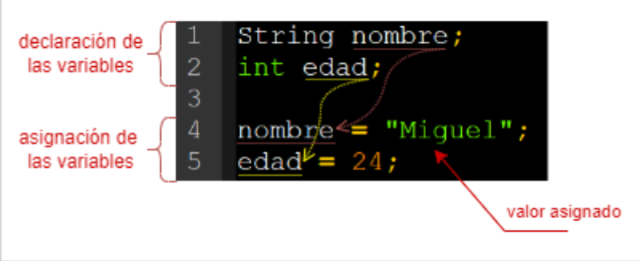
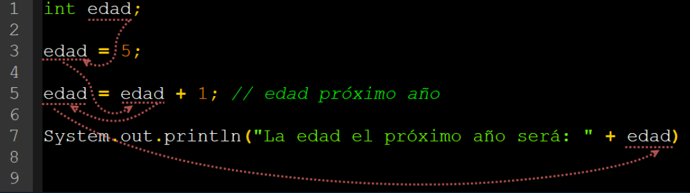
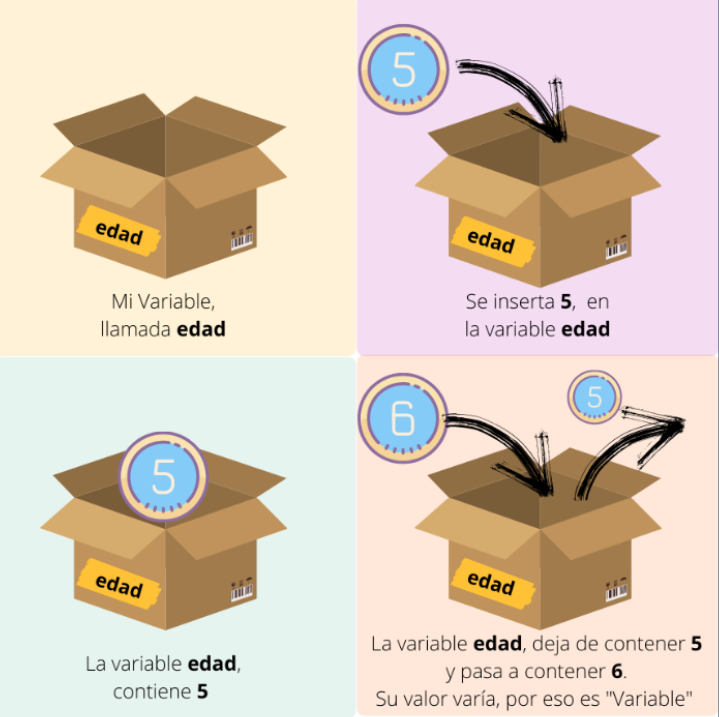

# VARIABLES

[← Regresar a notas](../../README.md)  

---

> #### Variable
> Es un espacio en memoria RAM en el que se almacena un dato.
>
> 

> #### Declaración de una variable
> Consiste en definir el tipo de dato, el nombre de la variable y opcionalmente la asignación de un valor inicial. 
> Este proceso <u>implica reservar un espacio en memoria</u> para la variable.
>
> 

> #### Asignación de un valor a una variable
> Consiste en utilizar el operador de asignación `=` para asignar un valor a la variable. 
> Este proceso <u>implica almacenar un valor  en el espacio de memoria reservado</u> al momento de declarar la variable.
>
> 

> #### Referencia a una variable
> Significa que una vez que se ha asignado un valor a una variable, se puede utilizar su nombre en el código para hacer referencia a ese valor en diferentes partes del programa. 
> Este proceso <u>implica recuperar el valor almacenado en el espacio de memoria</u>.
>
> 

> #### Valor variable
> El valor de una variable puede cambiar.
> 
> 

> #### Scope de una variable (ámbito o contexto)
> Se refiere al lugar donde se declara la variable y es accesible dentro del código fuente.
> 
> 
> 
