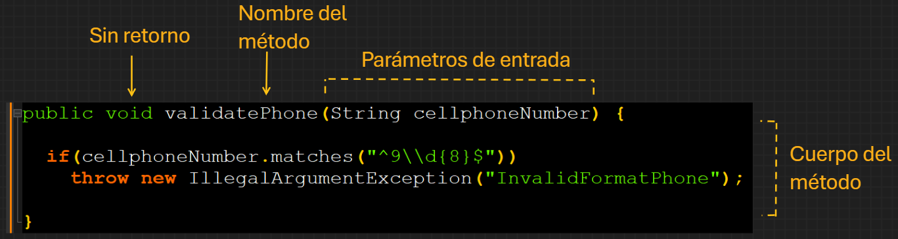

# MÉTODOS (FUNCIONES Y PROCEDIMIENTOS)

[← Regresar a notas](../../README.md) <br>

---

> - Un método es un bloque de código que recibe ciertos datos, los procesa y puede devolver una respuesta.
> - Pueden ser llamados desde otras partes del programa.

## Tipos de métodos

> **Funciones**
> 
> 

> **Procedimientos**
>
> 

### 1. Funciones
> 
>
> - Una función es un método que realiza una tarea y devuelve un valor (datos primitivos u objetos) con la instrucción `return`.
> - Son útiles cuando necesitas realizar un procesamiento y recuperar algún valor de vuelta.
> - La instrucción `return` debe devolver una variable del <u>mismo tipo que el retorno del método</u>.
>
> ```java
> //obtener el ID de un producto
> public long getId() {
>   return this.id;
> }
> ```
>
> ```java
> //calcular el interés
> public double calculateInterest(double balance, double interestRate) {
>   double interest = balance * interestRate;
>   return interest;
> }
> ```
>
> ```java
> //determinar si un cliente es mayor de edad
> public boolean isOfLegalAge(Customer customer) {
>   boolean isOfLegalAge = (customer.getAge() <= 18);
>   return isOfLegalAge;
> }
> ```
>
> ```java
> //generar la descripción de una fecha
> public String generateDateDescription(String dateStr) {
>   DateTimeFormatter formatter = DateTimeFormatter.ofPattern("dd/MM/yyyy");
>   LocalDate date = LocalDate.parse(dateStr, formatter);
>   return date.format(DateTimeFormatter.ofPattern("d 'de' MMMM 'de' yyyy", new Locale("es", "ES")));
> }
> ```
>
> ```java
> //filtrar un producto mediante su ID
> public Product findById(String id, List<Product> products) {
>   for(Product product: products) {
>     if(product.getId().equals(id))
>       return product;
>   }
>   return null;
> }
> ```

### 2. Procedimientos
> 
> 
> - Un procedimiento es un método que realiza una tarea, pero no devuelve ningún valor, para lo cual el tipo de retorno es `void` (vacío).
> - Son útiles cuando necesitas realizar una acción, pero no requieres un valor de vuelta.
>
> ```java
> //asignar el ID de un producto
> public void setId(long id) {
>   this.id = id;
> }
> ```
>
> ```java
> //validar formato de un número celular
> public void validatePhone(String cellphoneNumber) {
>   if(!cellphoneNumber.matches("^9\\d{8}$"))
>     throw new IllegalArgumentException("InvalidFormatPhone");
> }
> ```
>
> ```java
> //eliminar registro de producto
> public void deleteProduct(long id) {
>   productRepository.delete(id);
> }
> ```