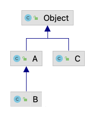

# OBJECT

[← Regresar a notas](../../README.md) <br>

---

## 1. Clase Object
> - La clase `Object` es la superclase de todas las clases en Java. Esto significa que todas las clases en Java heredan directa o indirectamente de `Object`. 
> - Proporciona un conjunto de métodos que pueden ser utilizados por todas las clases. Por ejemplo, `toString()`, `equals()`, `hashCode()`, etc.
>
> 

> #### toString()
> - Devuelve una representación del objeto en forma de cadena.
> - Por defecto, este método devuelve el nombre de la clase del objeto y su dirección de memoria como un valor hexadecimal.
> - Este método puede ser sobreescrito para proporcionar una representación más significativa.


## 2. Comparación de objetos y datos primitivos

> En Java, la comparación de datos primitivos y objetos sigue reglas diferentes debido a la naturaleza de cada tipo. 

### Comparación de datos primitivos
Los datos primitivos (`int`, `char`, `double`, etc.) se comparan directamente usando el operador `==`. 
Este operador compara el valor contenido en las variables.

```java
  int a = 5;
  int b = 5;
  if (a == b) {
    System.out.println("Both are equal");  // Se imprimirá ya que 5 es igual a 5
  }
```

### Comparación de objetos
- A diferencia de los datos primitivos, cuando se comparan objetos mediante `==`, realmente lo que se está haciendo es verificar si ambos objetos apuntan a la misma dirección de memoria.
- Para comparar el valor dentro del objeto se debe utilizar el método `equals()`.

```java
  Integer x = new Integer(5);
  Integer y = new Integer(5);
  
  if (x == y) {
    System.out.println("Both are the same object");  // No se imprimirá, ya que x e y no apuntan a la misma dirección de memoria
  }
  
  if (x.equals(y)) {
    System.out.println("Both have the same value");  // Se imprimirá ya que x e y contienen el mismo valor
  }
```
