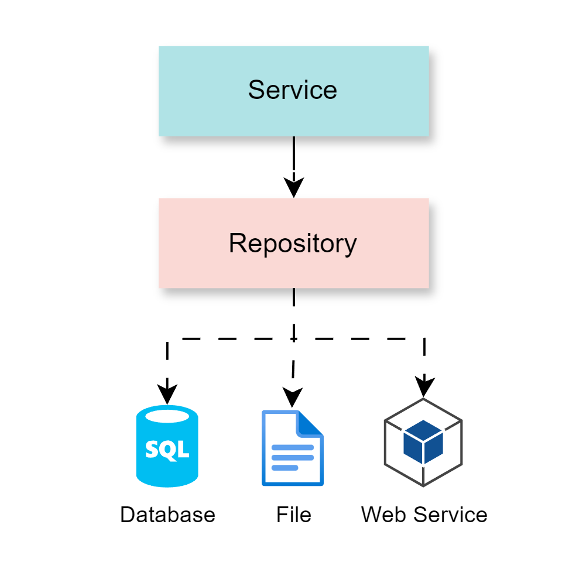

# ARQUITECTURA DE PAQUETES

[← Regresar a notas](../../README.md) <br>

---

> - La arquitectura de paquetes se refiere a la organización y estructuración de las clases en módulos dentro de un sistema de software.
> - La arquitectura de paquetes ayuda a definir una jerarquía clara y a evitar conflictos de nombres entre clases.

```
  com.bcp.yape.transfer:
  ├───models                        // paquete que contiene las clases modelo
  │   ├───DestinationAccount.java
  │   ├───OriginAccount.java
  │   └─── ...
  ├───service                       // paquete que contiene las clases con lógica de negocio (clases con sufijo Service)
  │   ├───TransferService.java
  │   └─── ...
  ├───repository
  │   ├───AccountsRepository.java   // paquete que contiene las clases que acceden a una fuente de datos (clases con sufijo Repository)
  │   └─── ...
  └─── ...
```


