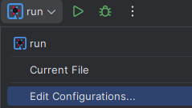
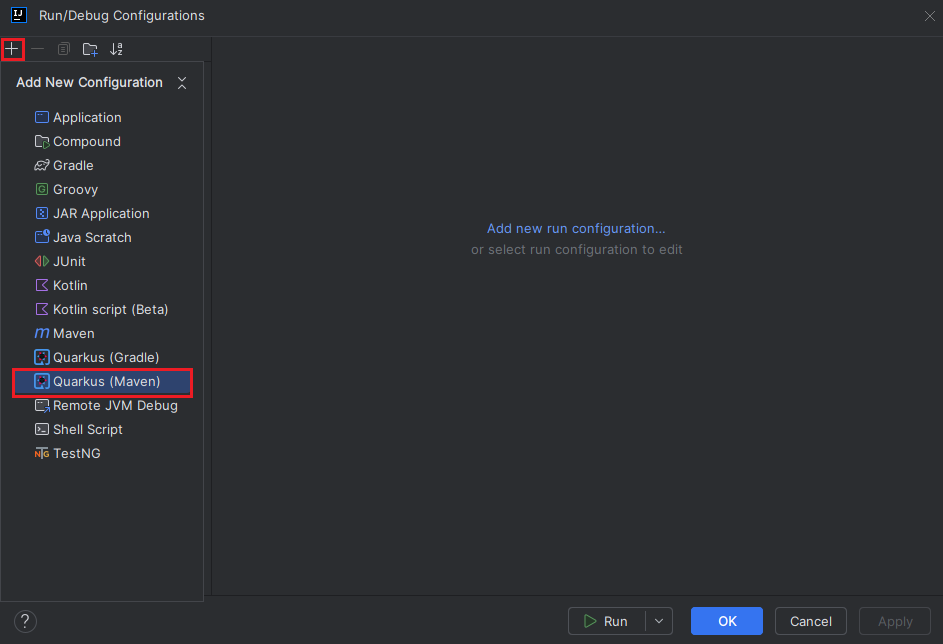
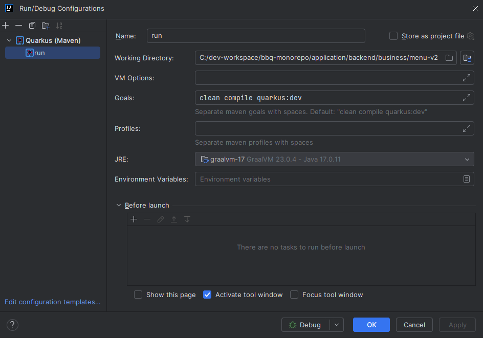

# QUARKUS - INYECCIÓN DE DEPENDENCIAS (DI)

[← Regresar a notas](../../README.md) <br>

---

Quarkus al ser un producto compatible de Microprofile implementa la especificación CDI.

## Arc
- Quarkus utiliza su propia implementación ligera de CDI llamada Arc.
- Arc está diseñado para ser rápido y eficiente en términos de memoria (crítico en microservicios y nube).
- Está optimizado para el modelo de programación reactivo y tiempos de arranque rápidos.


---

## Ejecutar aplicaciones Quarkus desde IntelliJ IDEA

- Instale el plugin `Quarkus Run Configs`


- Seleccione `Edit configuration`



- Agregue una nueva configuración para Quarkus con Maven



- Configure el proyecto
```
clean compile quarkus:dev
```

